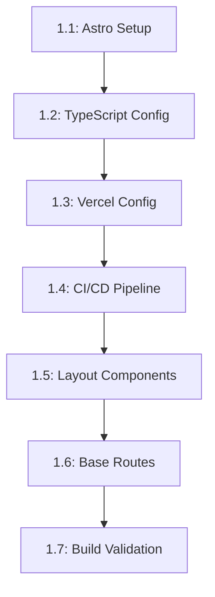

# Tasks --- M1: Project Setup & Astro Scaffold

## Overview

This milestone covers the foundational setup of the Astro project, including infrastructure configuration, CI/CD pipeline, and base layout components.

## Task Dependency Graph

## Tasks

### Phase 1: Project Setup

#### Task 1.1: Astro 7.x Project Setup

- **Status**: TODO
- **Estimate**: 30 minutes
- **Dependencies**: []
- **Type**: Setup
- **Description**: Initialize Astro 7.x project with hybrid mode configuration
- **Steps**:
  1. Create new Astro project using `npm create astro@latest`
  2. Configure `output: "hybrid"` in astro.config.mjs
  3. Install required dependencies
  4. Verify build completes successfully
  5. Test development server

#### Task 1.2: TypeScript Configuration

- **Status**: TODO
- **Estimate**: 15 minutes
- **Dependencies**: [1.1]
- **Type**: Setup
- **Description**: Configure TypeScript for project type safety
- **Steps**:
  1. Install TypeScript and Astro TypeScript tools
  2. Create tsconfig.json with proper paths
  3. Configure type checking in CI
  4. Verify type checking passes

#### Task 1.3: Vercel Deployment Config

- **Status**: TODO
- **Estimate**: 10 minutes
- **Dependencies**: [1.1]
- **Type**: Setup
- **Description**: Configure Vercel deployment settings
- **Steps**:
  1. Create vercel.json with proper settings
  2. Configure build output directory
  3. Set up environment variables structure
  4. Test local Vercel build

### Phase 2: CI/CD Pipeline

#### Task 1.4: GitHub Actions Workflow

- **Status**: TODO
- **Estimate**: 30 minutes
- **Dependencies**: [1.2]
- **Type**: Testing
- **Description**: Create CI/CD pipeline for automated builds
- **Steps**:
  1. Create .github/workflows/ci.yml
  2. Configure build step
  3. Add linting and type checking
  4. Configure Vercel deployment
  5. Test workflow on sample branch

### Phase 3: Layout Components

#### Task 1.5: Base Layout Components

- **Status**: TODO
- **Estimate**: 45 minutes
- **Dependencies**: [1.1]
- **Type**: Component
- **Description**: Create base layout and navigation components
- **Steps**:
  1. Create Layout.astro wrapper component
  2. Implement responsive navigation
  3. Create header component with logo
  4. Create footer component
  5. Style components for consistency

#### Task 1.6: Base Routes

- **Status**: TODO
- **Estimate**: 20 minutes
- **Dependencies**: [1.5]
- **Type**: Component
- **Description**: Create base route files for main pages
- **Steps**:
  1. Create src/pages/index.astro
  2. Create src/pages/contact.astro
  3. Configure navigation links
  4. Test all routes work locally

#### Task 1.7: Build Validation

- **Status**: TODO
- **Estimate**: 20 minutes
- **Dependencies**: [1.4, 1.6]
- **Type**: Testing
- **Description**: Validate build and deployment configuration
- **Steps**:
  1. Run production build locally
  2. Verify all assets are optimized
  3. Test Vercel build locally
  4. Fix any build errors

## Summary

| Category | Count | Estimate |
|----------|-------|----------|
| Setup | 3 | 55 minutes |
| Testing | 2 | 50 minutes |
| Component | 2 | 65 minutes |
| **Total** | **7** | **170 minutes** |

## Acceptance Criteria

1. Astro 7.x project created with hybrid mode
2. TypeScript configured and type checking passes
3. CI/CD pipeline triggers on push
4. Layout components render correctly
5. All routes accessible and functional
6. Production build completes without errors

## References

- [M1 Requirements](./requirements.md)
- [Astro Hybrid Mode](https://docs.astro.build/en/guides/deploy/)
- [Vercel Astro Guide](https://vercel.com/docs/frameworks/astro)