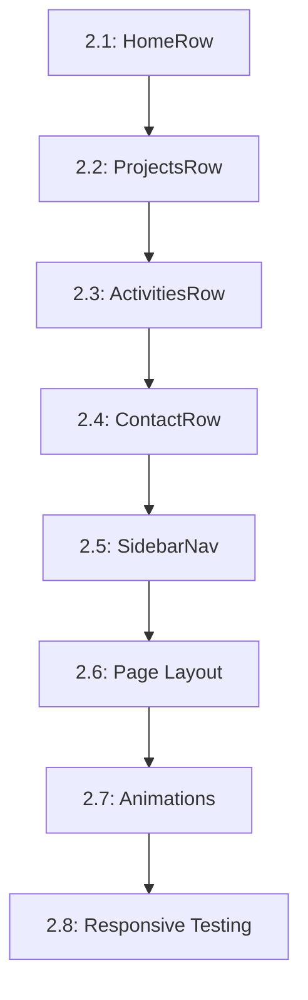

# Tasks --- M2: Core Rows & Navigation

## Overview

This milestone implements the four content rows (Home, Projects, Activities, Contact) and navigation system that forms the portfolio's structure.

## Task Dependency Graph

## Tasks

### Phase 1: Row Components

#### Task 2.1: HomeRow Component

- **Status**: TODO
- **Estimate**: 45 minutes
- **Dependencies**: []
- **Type**: Component
- **Description**: Create the hero section with title, subtitle, and CTA
- **Steps**:
  1. Create HomeRow.astro component
  2. Implement hero section structure
  3. Add social media links
  4. Style with responsive design
  5. Test on different screen sizes

#### Task 2.2: ProjectsRow Component

- **Status**: TODO
- **Estimate**: 45 minutes
- **Dependencies**: [2.1]
- **Type**: Component
- **Description**: Create project grid with card components
- **Steps**:
  1. Create ProjectsRow.astro component
  2. Implement responsive grid layout
  3. Create project card structure
  4. Add hover effects and transitions
  5. Implement empty state

#### Task 2.3: ActivitiesRow Component

- **Status**: TODO
- **Estimate**: 45 minutes
- **Dependencies**: [2.1]
- **Type**: Component
- **Description**: Create activities display with timeline layout
- **Steps**:
  1. Create ActivitiesRow.astro component
  2. Implement timeline or grid layout
  3. Create activity item structure
  4. Add date formatting
  5. Implement empty state

#### Task 2.4: ContactRow Component

- **Status**: TODO
- **Estimate**: 45 minutes
- **Dependencies**: [2.1]
- **Type**: Component
- **Description**: Create contact form with validation
- **Steps**:
  1. Create ContactRow.astro component
  2. Implement form with required fields
  3. Add form validation
  4. Create success/error message states
  5. Add alternative contact methods

### Phase 2: Navigation

#### Task 2.5: SidebarNav Component

- **Status**: TODO
- **Estimate**: 40 minutes
- **Dependencies**: [2.1]
- **Type**: Component
- **Description**: Create navigation with scroll detection
- **Steps**:
  1. Create SidebarNav.astro component
  2. Implement click handlers for scrolling
  3. Add Intersection Observer for active section
  4. Style for desktop and mobile
  5. Test smooth scroll functionality

#### Task 2.6: Page Layout Integration

- **Status**: TODO
- **Estimate**: 20 minutes
- **Dependencies**: [2.1, 2.5]
- **Type**: Component
- **Description**: Integrate all rows into main page
- **Steps**:
  1. Update index.astro to include all rows
  2. Ensure proper section IDs for scrolling
  3. Test navigation to each section
  4. Verify scrolling behavior

#### Task 2.7: Animations

- **Status**: TODO
- **Estimate**: 30 minutes
- **Dependencies**: [2.6]
- **Type**: Component
- **Description**: Add smooth scroll and entry animations
- **Steps**:
  1. Implement smooth scroll behavior
  2. Add fade-in animations on scroll
  3. Style hover states and transitions
  4. Test animation performance

#### Task 2.8: Responsive Testing

- **Status**: TODO
- **Estimate**: 30 minutes
- **Dependencies**: [2.7]
- **Type**: Testing
- **Description**: Test all components on different screen sizes
- **Steps**:
  1. Test on mobile (320px-767px)
  2. Test on tablet (768px-1023px)
  3. Test on desktop (1024px+)
  4. Verify layout adapts correctly

## Summary

| Category | Count | Estimate |
|----------|-------|----------|
| Component | 6 | 250 minutes |
| Testing | 1 | 30 minutes |
| **Total** | **7** | **280 minutes** |

## Acceptance Criteria

1. All four row components render correctly
2. Navigation scrolls to sections smoothly
3. Active section highlights in navigation
4. Responsive design works on all breakpoints
5. Animations are performant and smooth

## References

- [M2 Requirements](./requirements.md)
- [M1 Completed Setup](../M1-Setup/)