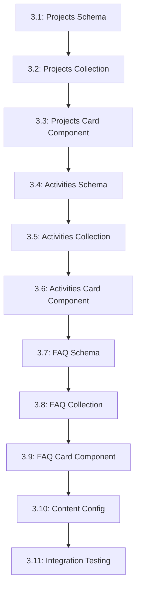

# Tasks --- M3: Content Integration

## Overview

This milestone integrates content collections for Projects, Activities, and FAQ, enabling non-technical content management through Markdown files.

## Task Dependency Graph

## Tasks

### Phase 1: Content Collections Setup

#### Task 3.1: Projects Collection Schema

- **Status**: TODO
- **Estimate**: 20 minutes
- **Dependencies**: []
- **Type**: Setup
- **Description**: Create TypeScript schema for projects content with media fields
- **Steps**:
  1. Create `src/content/projects/schema.ts`
  2. Define project fields: title, description, tags, image, link
  3. Add media fields: heroImage, videoPitch, pinned
  4. Add required field validation
  5. Configure collection path and type

#### Task 3.2: Projects Collection Files

- **Status**: TODO
- **Estimate**: 30 minutes
- **Dependencies**: [3.1]
- **Type**: Setup
- **Description**: Create sample project Markdown files with media support
- **Steps**:
  1. Create `src/content/projects/` directory
  2. Create sample project files (3-5)
  3. Add proper frontmatter with media fields (heroImage, videoPitch, pinned)
  4. Pin this personal portfolio project to the top (pinned: true)
  5. Verify build succeeds with sample data

#### Task 3.3: ProjectCard Component

- **Status**: TODO
- **Estimate**: 25 minutes
- **Dependencies**: [3.2]
- **Type**: Component
- **Description**: Create component to render individual projects
- **Steps**:
  1. Create `src/components/ProjectCard.astro`
  2. Accept project data as props
  3. Implement card layout
  4. Add image, title, description, tags
  5. Add click handler for details
  6. Implement pinned project display (optional visual indicator)

#### Task 3.2.1: Pinned Projects Sorting Logic

- **Status**: TODO
- **Estimate**: 15 minutes
- **Dependencies**: [3.2]
- **Type**: Logic
- **Description**: Implement sorting logic to display pinned projects first
- **Steps**:
  1. Query projects from collection
  2. Separate pinned (pinned: true) from non-pinned projects
  3. Concatenate pinned projects first, then non-pinned
  4. Maintain original order within each group
  5. Test with mixed pinned/non-pinned projects

#### Task 3.4: Activities Collection Schema

- **Status**: TODO
- **Estimate**: 20 minutes
- **Dependencies**: [3.1]
- **Type**: Setup
- **Description**: Create TypeScript schema for activities content with media support
- **Steps**:
  1. Create `src/content/activities/schema.ts`
  2. Define activity fields: title, date, description, location
  3. Add media fields: backgroundImage, mediaType, links.eventPage, links.video
  4. Add date format validation
  5. Configure collection settings

#### Task 3.5: Activities Collection Files

- **Status**: TODO
- **Estimate**: 30 minutes
- **Dependencies**: [3.4]
- **Type**: Setup
- **Description**: Create sample activity Markdown files
- **Steps**:
  1. Create `src/content/activities/` directory
  2. Create sample activity files (5-10)
  3. Add proper frontmatter with dates
  4. Verify chronological sorting works

#### Task 3.6: ActivityCard Component

- **Status**: TODO
- **Estimate**: 25 minutes
- **Dependencies**: [3.5]
- **Type**: Component
- **Description**: Create component to render individual activities
- **Steps**:
  1. Create `src/components/ActivityCard.astro`
  2. Accept activity data as props
  3. Implement timeline item layout
  4. Add date formatting
  5. Support responsive display

#### Task 3.7: FAQ Collection Schema

- **Status**: TODO
- **Estimate**: 20 minutes
- **Dependencies**: [3.1]
- **Type**: Setup
- **Description**: Create TypeScript schema for FAQ content with enhanced fields
- **Steps**:
  1. Create `src/content/faq/schema.ts`
  2. Define FAQ fields: question, answer, category
  3. Add enhanced fields: category, relatedProjects
  4. Add category validation
  5. Configure collection settings

#### Task 3.8: FAQ Collection Files

- **Status**: TODO
- **Estimate**: 30 minutes
- **Dependencies**: [3.7]
- **Type**: Setup
- **Description**: Create sample FAQ Markdown files
- **Steps**:
  1. Create `src/content/faq/` directory
  2. Create sample FAQ files (10-15)
  3. Add proper frontmatter with categories
  4. Verify category filtering works

#### Task 3.9: FAQCard Component

- **Status**: TODO
- **Estimate**: 25 minutes
- **Dependencies**: [3.8]
- **Type**: Component
- **Description**: Create component to render individual FAQ items
- **Steps**:
  1. Create `src/components/FAQCard.astro`
  2. Accept FAQ data as props
  3. Implement collapsible card
  4. Add expand/collapse animation
  5. Support keyboard accessibility

#### Task 3.10: Content Configuration

- **Status**: TODO
- **Estimate**: 15 minutes
- **Dependencies**: [3.1, 3.4, 3.7]
- **Type**: Setup
- **Description**: Configure all content collections in Astro
- **Steps**:
  1. Update `src/content/config.ts`
  2. Register all three collections
  3. Configure build behavior
  4. Test collection queries

#### Task 3.11: Integration Testing

- **Status**: TODO
- **Estimate**: 30 minutes
- **Dependencies**: [3.3, 3.6, 3.9, 3.10]
- **Type**: Testing
- **Description**: Test all content integration points
- **Steps**:
  1. Verify content renders correctly
  2. Test schema validation
  3. Verify error handling
  4. Test with missing/invalid content

## Summary

| Category | Count | Estimate |
|----------|-------|----------|
| Setup | 7 | 160 minutes |
| Component | 3 | 75 minutes |
| Logic | 1 | 15 minutes |
| Testing | 1 | 30 minutes |
| **Total** | **12** | **280 minutes** |

## Acceptance Criteria

1. All three content collections configured with media fields
2. Markdown files validate against schemas including media fields
3. Content cards render from collection data
4. Pinned projects appear at the top of the list
5. Content updates trigger rebuild
6. Error handling works for invalid content
7. Media fields (heroImage, videoPitch, pinned) work for projects
8. Media fields (backgroundImage, mediaType, links) work for activities
9. Enhanced fields (category, relatedProjects) work for FAQ

## References

- [M3 Requirements](./requirements.md)
- [M2 Completed Rows](../M2-Rows-Nav/)