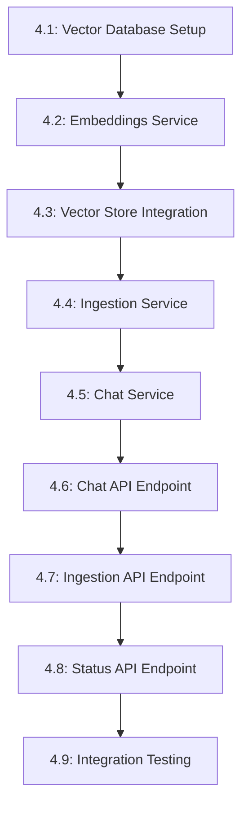

# Tasks --- M4: RAG Chatbot Backend

## Overview

This milestone implements the backend infrastructure for the RAG chatbot, including vector database, embeddings, and API endpoints.

## Task Dependency Graph

## Tasks

### Phase 1: Infrastructure Setup

#### Task 4.1: Vector Database Setup

- **Status**: TODO
- **Estimate**: 45 minutes
- **Dependencies**: []
- **Type**: Setup
- **Description**: Configure vector database (Pinecone)
- **Steps**:
  1. Create Pinecone account and API key
  2. Install Pinecone client library
  3. Create index with 1536 dimensions
  4. Test database connection
  5. Configure environment variables

#### Task 4.2: Embeddings Service

- **Status**: TODO
- **Estimate**: 30 minutes
- **Dependencies**: []
- **Type**: Component
- **Description**: Create OpenAI embeddings integration
- **Steps**:
  1. Install OpenAI SDK
  2. Create `src/lib/embeddings.ts`
  3. Implement `generateEmbeddings()` function
  4. Handle batch processing
  5. Add error handling

### Phase 2: Core Services

#### Task 4.3: Vector Store Integration

- **Status**: TODO
- **Estimate**: 40 minutes
- **Dependencies**: [4.1, 4.2]
- **Type**: Component
- **Description**: Integrate vector database operations
- **Steps**:
  1. Create `src/lib/vectorStore.ts`
  2. Implement `upsertVectors()` function
  3. Implement `searchVectors()` function
  4. Handle metadata storage
  5. Add batch operations

#### Task 4.4: Ingestion Service

- **Status**: TODO
- **Estimate**: 45 minutes
- **Dependencies**: [4.3]
- **Type**: Component
- **Description**: Create document ingestion pipeline
- **Steps**:
  1. Create `src/lib/ingestion.ts`
  2. Implement text chunking (e.g., 500 tokens)
  3. Add chunk overlap (50 tokens)
  4. Process documents in batches
  5. Track ingestion status

#### Task 4.5: Chat Service

- **Status**: TODO
- **Estimate**: 50 minutes
- **Dependencies**: [4.3]
- **Type**: Component
- **Description**: Create RAG chat orchestration
- **Steps**:
  1. Create `src/lib/rag.ts`
  2. Implement query processing
  3. Add context retrieval
  4. Format prompt with context
  5. Generate LLM response

### Phase 3: API Endpoints

#### Task 4.6: Chat API Endpoint

- **Status**: TODO
- **Estimate**: 30 minutes
- **Dependencies**: [4.5]
- **Type**: Component
- **Description**: Create `/api/chat` endpoint
- **Steps**:
  1. Create `src/pages/api/chat.ts`
  2. Implement POST handler
  3. Accept query and history
  4. Call RAG service
  5. Return response

#### Task 4.7: Ingestion API Endpoint

- **Status**: TODO
- **Estimate**: 25 minutes
- **Dependencies**: [4.4]
- **Type**: Component
- **Description**: Create `/api/ingest` endpoint
- **Steps**:
  1. Create `src/pages/api/ingest.ts`
  2. Accept document upload
  3. Call ingestion service
  4. Return ingestion ID
  5. Handle errors gracefully

#### Task 4.8: Status API Endpoint

- **Status**: TODO
- **Estimate**: 15 minutes
- **Dependencies**: [4.3]
- **Type**: Component
- **Description**: Create `/api/status` endpoint
- **Steps**:
  1. Create `src/pages/api/status.ts`
  2. Check database connectivity
  3. Report index status
  4. Return system health
  5. Include version info

#### Task 4.9: Integration Testing

- **Status**: TODO
- **Estimate**: 45 minutes
- **Dependencies**: [4.6, 4.7, 4.8]
- **Type**: Testing
- **Description**: Test all components together
- **Steps**:
  1. Test end-to-end chat flow
  2. Test document ingestion
  3. Verify embeddings generated
  4. Test error handling
  5. Measure response times

## Summary

| Category | Count | Estimate |
|----------|-------|----------|
| Setup | 1 | 45 minutes |
| Component | 7 | 285 minutes |
| Testing | 1 | 45 minutes |
| **Total** | **9** | **375 minutes** |

## Acceptance Criteria

1. Vector database connected and queryable
2. Embeddings generated successfully
3. Documents can be ingested and searched
4. Chat API returns relevant responses
5. All API endpoints respond correctly

## References

- [M4 Requirements](./requirements.md)
- [M3 Completed Content](../M3-Content/)