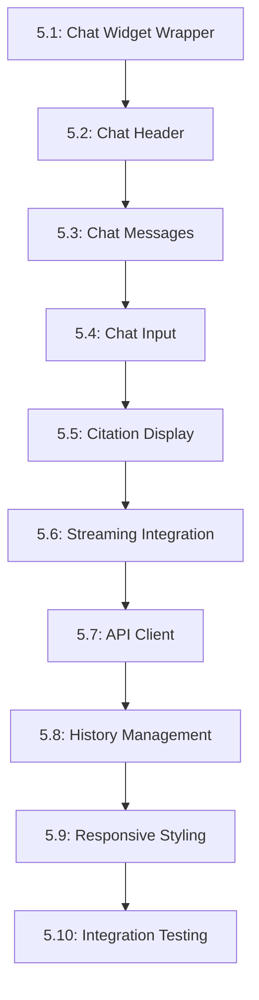

# Tasks --- M5: RAG Chatbot UI

## Overview

This milestone implements the frontend UI for the RAG chatbot, including the chat widget, streaming responses, and conversational interface.

## Task Dependency Graph

## Tasks

### Phase 1: Core Components

#### Task 5.1: Chat Widget Wrapper

- **Status**: TODO
- **Estimate**: 40 minutes
- **Dependencies**: []
- **Type**: Component
- **Description**: Create main chat widget container
- **Steps**:
  1. Create `src/components/ChatWidget.astro`
  2. Implement open/close toggle
  3. Add widget container styling
  4. Handle mobile responsiveness
  5. Integrate with page layout

#### Task 5.2: Chat Header

- **Status**: TODO
- **Estimate**: 20 minutes
- **Dependencies**: [5.1]
- **Type**: Component
- **Description**: Create widget header with title and close button
- **Steps**:
  1. Create `src/components/ChatHeader.astro`
  2. Add title and close button
  3. Implement toggle animation
  4. Add accessibility labels
  5. Style for light/dark mode

#### Task 5.3: Chat Messages

- **Status**: TODO
- **Estimate**: 35 minutes
- **Dependencies**: [5.1]
- **Type**: Component
- **Description**: Create message display component
- **Steps**:
  1. Create `src/components/ChatMessages.astro`
  2. Implement message list layout
  3. Style user vs bot messages
  4. Add timestamp display
  5. Handle empty state

#### Task 5.4: Chat Input

- **Status**: TODO
- **Estimate**: 30 minutes
- **Dependencies**: [5.1]
- **Type**: Component
- **Description**: Create user input component
- **Steps**:
  1. Create `src/components/ChatInput.astro`
  2. Implement text input field
  3. Add send button
  4. Handle Enter key submission
  5. Add input validation

### Phase 2: Advanced Features

#### Task 5.5: Citation Display

- **Status**: TODO
- **Estimate**: 30 minutes
- **Dependencies**: [5.3]
- **Type**: Component
- **Description**: Create citation display component
- **Steps**:
  1. Create `src/components/CitationDisplay.astro`
  2. Implement numbered citations in text
  3. Create citation list below message
  4. Add source link handling
  5. Style citations distinctly

#### Task 5.6: Streaming Integration

- **Status**: TODO
- **Estimate**: 40 minutes
- **Dependencies**: [5.6, 5.3]
- **Type**: Component
- **Description**: Integrate streaming responses
- **Steps**:
  1. Implement streaming client
  2. Update messages in real-time
  3. Add streaming indicator
  4. Handle cancel button
  5. Format streamed text

#### Task 5.7: API Client

- **Status**: TODO
- **Estimate**: 25 minutes
- **Dependencies**: [5.6]
- **Type**: Component
- **Description**: Create chat API client
- **Steps**:
  1. Create `src/lib/chatClient.ts`
  2. Implement `sendMessage()` function
  3. Handle conversation history
  4. Process citations from response
  5. Add error handling

#### Task 5.8: History Management

- **Status**: TODO
- **Estimate**: 25 minutes
- **Dependencies**: [5.7]
- **Type**: Component
- **Description**: Implement conversation history
- **Steps**:
  1. Add history state management
  2. Store in localStorage
  3. Load history on init
  4. Add clear history button
  5. Limit history size

#### Task 5.9: Responsive Styling

- **Status**: TODO
- **Estimate**: 30 minutes
- **Dependencies**: [5.1, 5.4]
- **Type**: Component
- **Description**: Ensure responsive design
- **Steps**:
  1. Test on mobile devices
  2. Adjust widget positioning
  3. Touch-friendly sizing
  4. Responsive message layout
  5. Performance optimization

#### Task 5.10: Integration Testing

- **Status**: TODO
- **Estimate**: 45 minutes
- **Dependencies**: [5.8, 5.9]
- **Type**: Testing
- **Description**: Test all components together
- **Steps**:
  1. Test chat flow end-to-end
  2. Verify streaming works
  3. Test citations display
  4. Verify history persistence
  5. Test mobile responsiveness

## Summary

| Category | Count | Estimate |
|----------|-------|----------|
| Component | 8 | 280 minutes |
| Testing | 1 | 45 minutes |
| **Total** | **9** | **325 minutes** |

## Acceptance Criteria

1. Chat widget opens and closes smoothly
2. Streaming responses display in real-time
3. Citations appear with source links
4. Conversation history persists
5. Responsive design works on all devices

## References

- [M5 Requirements](./requirements.md)
- [M4 Backend](../M4-RAG-Backend/)