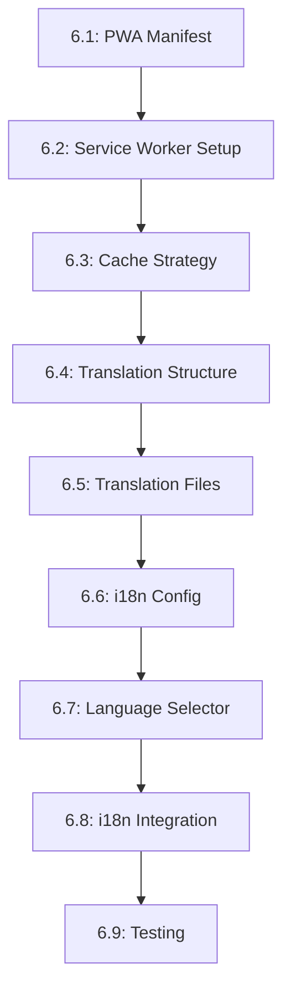

# Tasks --- M6: PWA & i18n

## Overview

This milestone implements PWA capabilities and internationalization support, enabling offline access and multilingual content.

## Task Dependency Graph

## Tasks

### Phase 1: PWA Implementation

#### Task 6.1: PWA Manifest

- **Status**: TODO
- **Estimate**: 20 minutes
- **Dependencies**: []
- **Type**: Setup
- **Description**: Create web app manifest file
- **Steps**:
  1. Create `public/manifest.webmanifest`
  2. Add name, short_name, description
  3. Define icon assets (192x192, 512x512)
  4. Set display mode to standalone
  5. Configure theme and background colors

#### Task 6.2: Service Worker Setup

- **Status**: TODO
- **Estimate**: 30 minutes
- **Dependencies**: []
- **Type**: Component
- **Description**: Create service worker script
- **Steps**:
  1. Create `src/scripts/sw.js`
  2. Implement install event
  3. Implement activate event
  4. Add fetch event handler
  5. Register service worker in layout

#### Task 6.3: Cache Strategy

- **Status**: TODO
- **Estimate**: 35 minutes
- **Dependencies**: [6.2]
- **Type**: Component
- **Description**: Implement caching strategy
- **Steps**:
  1. Cache critical assets on install
  2. Implement cache-first for static assets
  3. Implement network-first for API
  4. Handle dynamic content caching
  5. Implement cache versioning

### Phase 2: i18n Implementation

#### Task 6.4: Translation Structure

- **Status**: TODO
- **Estimate**: 20 minutes
- **Dependencies**: []
- **Type**: Setup
- **Description**: Set up translation file structure
- **Steps**:
  1. Create `src/content/i18n/` directory
  2. Create English translations (en.json)
  3. Create Spanish translations (es.json)
  4. Define translation keys structure
  5. Add missing key detection

#### Task 6.5: Translation Files

- **Status**: TODO
- **Estimate**: 30 minutes
- **Dependencies**: [6.4]
- **Type**: Setup
- **Description**: Create comprehensive translation files
- **Steps**:
  1. Translate all UI text to English
  2. Translate all UI text to Spanish
  3. Ensure key consistency
  4. Add context comments for translators
  5. Validate JSON syntax

#### Task 6.6: i18n Configuration

- **Status**: TODO
- **Estimate**: 25 minutes
- **Dependencies**: [6.4]
- **Type**: Setup
- **Description**: Configure Astro i18n routing
- **Steps**:
  1. Update `astro.config.mjs`
  2. Configure default locale
  3. Add supported locales
  4. Set up routing structure
  5. Configure i18n navigation

#### Task 6.7: Language Selector

- **Status**: TODO
- **Estimate**: 25 minutes
- **Dependencies**: [6.6]
- **Type**: Component
- **Description**: Create language switcher component
- **Steps**:
  1. Create `LanguageSelector.astro`
  2. Implement dropdown UI
  3. Add language change handler
  4. Persist preference to localStorage
  5. Update URL on language change

#### Task 6.8: i18n Integration

- **Status**: TODO
- **Estimate**: 30 minutes
- **Dependencies**: [6.6, 6.7]
- **Type**: Component
- **Description**: Integrate i18n into components
- **Steps**:
  1. Update all components to use translations
  2. Implement translation hook/use
  3. Handle dynamic content translation
  4. Add fallback to default language
  5. Test all pages in both languages

#### Task 6.9: Testing

- **Status**: TODO
- **Estimate**: 30 minutes
- **Dependencies**: [6.3, 6.8]
- **Type**: Testing
- **Description**: Test PWA and i18n functionality
- **Steps**:
  1. Test offline mode
  2. Verify service worker updates
  3. Test language switching
  4. Verify URL updates
  5. Run Lighthouse PWA audit

## Summary

| Category | Count | Estimate |
|----------|-------|----------|
| Setup | 4 | 100 minutes |
| Component | 4 | 110 minutes |
| Testing | 1 | 30 minutes |
| **Total** | **9** | **240 minutes** |

## Acceptance Criteria

1. PWA manifest validates correctly
2. Service worker caches and serves assets
3. Offline mode works for key pages
4. Language switching works correctly
5. URLs include language codes
6. Lighthouse PWA audit passes

## References

- [M6 Requirements](./requirements.md)
- [M5 RAG Chatbot](../M5-RAG-UI/)