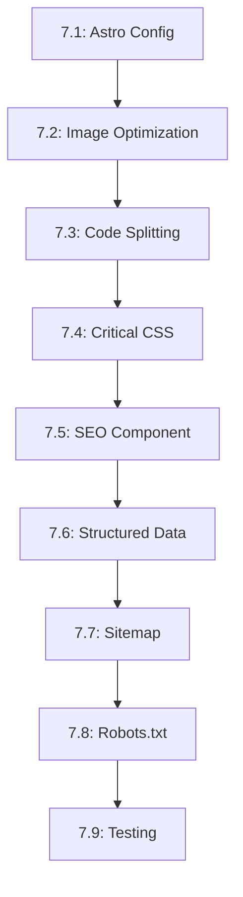

# Tasks --- M7: Performance & SEO

## Overview

This milestone implements performance optimizations and SEO features for the portfolio.

## Task Dependency Graph

## Tasks

### Phase 1: Configuration

#### Task 7.1: Astro Configuration

- **Status**: TODO
- **Estimate**: 20 minutes
- **Dependencies**: []
- **Type**: Setup
- **Description**: Optimize Astro configuration for performance
- **Steps**:
  1. Update `astro.config.mjs`
  2. Enable minification
  3. Configure output mode
  4. Add performance hints
  5. Test build output

#### Task 7.2: Image Optimization

- **Status**: TODO
- **Estimate**: 30 minutes
- **Dependencies**: []
- **Type**: Component
- **Description**: Create optimized image component
- **Steps**:
  1. Create `OptimizedImage.astro`
  2. Implement responsive images
  3. Add lazy loading
  4. Support WebP format
  5. Add placeholder blur

### Phase 2: Code Optimization

#### Task 7.3: Code Splitting

- **Status**: TODO
- **Estimate**: 25 minutes
- **Dependencies**: [7.1]
- **Type**: Component
- **Description**: Implement code splitting
- **Steps**:
  1. Identify heavy components
  2. Convert to dynamic imports
  3. Test code splitting works
  4. Monitor bundle sizes
  5. Optimize chunk sizes

#### Task 7.4: Critical CSS

- **Status**: TODO
- **Estimate**: 25 minutes
- **Dependencies**: [7.1]
- **Type**: Component
- **Description**: Extract and inline critical CSS
- **Steps**:
  1. Identify critical styles
  2. Extract to separate file
  3. Inline in head
  4. Load remaining CSS async
  5. Test render performance

### Phase 3: SEO Components

#### Task 7.5: SEO Component

- **Status**: TODO
- **Estimate**: 30 minutes
- **Dependencies**: [7.1]
- **Type**: Component
- **Description**: Create SEO meta tags component
- **Steps**:
  1. Create `SEO.astro` component
  2. Add meta title/description
  3. Add Open Graph tags
  4. Add Twitter cards
  5. Support i18n languages

#### Task 7.6: Structured Data

- **Status**: TODO
- **Estimate**: 30 minutes
- **Dependencies**: [7.5]
- **Type**: Component
- **Description**: Add structured data markup
- **Steps**:
  1. Create `StructuredData.astro`
  2. Add Person schema
  3. Add Project schemas
  4. Add Activity schemas
  5. Validate with Google test

#### Task 7.7: Sitemap Generation

- **Status**: TODO
- **Estimate**: 25 minutes
- **Dependencies**: [7.1]
- **Type**: Setup
- **Description**: Create XML sitemap
- **Steps**:
  1. Create `src/pages/sitemap.xml.ts`
  2. Include all pages
  3. Add last modified dates
  4. Support i18n hreflang
  5. Update on content change

#### Task 7.8: Robots.txt

- **Status**: TODO
- **Estimate**: 15 minutes
- **Dependencies**: [7.7]
- **Type**: Setup
- **Description**: Create robots.txt file
- **Steps**:
  1. Create `src/pages/robots.txt.ts`
  2. Include sitemap URL
  3. Allow/disallow appropriate paths
  4. Test with Google Search Console

#### Task 7.9: Testing

- **Status**: TODO
- **Estimate**: 45 minutes
- **Dependencies**: [7.2, 7.6, 7.7]
- **Type**: Testing
- **Description**: Test performance and SEO
- **Steps**:
  1. Run Lighthouse audit
  2. Check Core Web Vitals
  3. Validate structured data
  4. Verify sitemap generation
  5. Test with Google Search Console

## Summary

| Category | Count | Estimate |
|----------|-------|----------|
| Setup | 3 | 70 minutes |
| Component | 6 | 170 minutes |
| Testing | 1 | 45 minutes |
| **Total** | **10** | **285 minutes** |

## Acceptance Criteria

1. Lighthouse performance > 90
2. Core Web Vitals pass
3. Structured data validates
4. Sitemap generates correctly
5. All images optimized

## References

- [M7 Requirements](./requirements.md)
- [M6 PWA-i18n](../M6-PWA-i18n/)