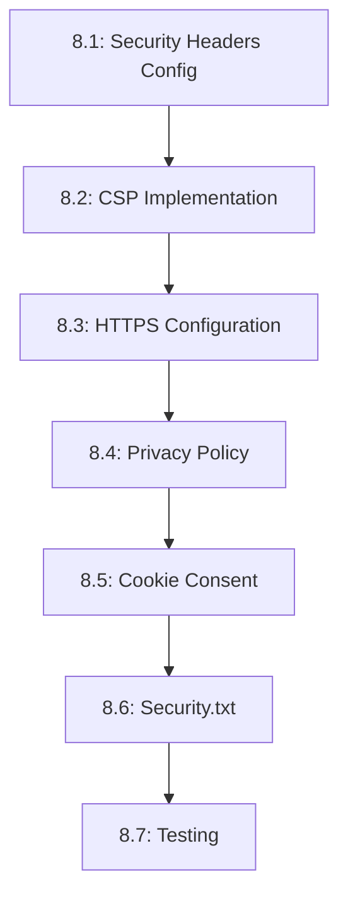

# Tasks --- M8: Security & Compliance

## Overview

This milestone implements security headers, CSP, and compliance features for the portfolio.

## Task Dependency Graph

## Tasks

### Phase 1: Security Configuration

#### Task 8.1: Security Headers Configuration

- **Status**: TODO
- **Estimate**: 30 minutes
- **Dependencies**: []
- **Type**: Setup
- **Description**: Configure security headers in Vercel
- **Steps**:
  1. Update `vercel.json`
  2. Add HSTS header
  3. Add X-Frame-Options
  4. Add X-Content-Type-Options
  5. Add Referrer-Policy

#### Task 8.2: CSP Implementation

- **Status**: TODO
- **Estimate**: 35 minutes
- **Dependencies**: [8.1]
- **Type**: Setup
- **Description**: Implement Content Security Policy
- **Steps**:
  1. Define CSP directives
  2. Add to `vercel.json` headers
  3. Test with report-only mode
  4. Monitor violation reports
  5. Enforce CSP after testing

#### Task 8.3: HTTPS Configuration

- **Status**: TODO
- **Estimate**: 15 minutes
- **Dependencies**: [8.1]
- **Type**: Setup
- **Description**: Configure HTTPS enforcement
- **Steps**:
  1. Verify HTTPS enabled on Vercel
  2. Set up HTTP to HTTPS redirect
  3. Verify certificate validity
  4. Test mixed content fixes

### Phase 2: Compliance Components

#### Task 8.4: Privacy Policy

- **Status**: TODO
- **Estimate**: 30 minutes
- **Dependencies**: []
- **Type**: Component
- **Description**: Create privacy policy page
- **Steps**:
  1. Create `src/pages/privacy-policy.astro`
  2. Write privacy policy content
  3. Add table of contents
  4. Include contact information
  5. Link from footer

#### Task 8.5: Cookie Consent

- **Status**: TODO
- **Estimate**: 30 minutes
- **Dependencies**: [8.4]
- **Type**: Component
- **Description**: Create cookie consent banner
- **Steps**:
  1. Create `CookieConsent.astro`
  2. Implement banner UI
  3. Add accept/reject buttons
  4. Store preference in localStorage
  5. Implement preference management

#### Task 8.6: Security.txt

- **Status**: TODO
- **Estimate**: 15 minutes
- **Dependencies**: [8.4]
- **Type**: Setup
- **Description**: Create security disclosure file
- **Steps**:
  1. Create `public/security.txt`
  2. Add contact information
  3. Include encryption key (optional)
  4. Add preferred languages
  5. Link from header

#### Task 8.7: Testing

- **Status**: TODO
- **Estimate**: 30 minutes
- **Dependencies**: [8.2, 8.5]
- **Type**: Testing
- **Description**: Test security and compliance
- **Steps**:
  1. Run security headers test
  2. Test CSP with report-uri
  3. Verify privacy policy
  4. Test cookie consent flow
  5. Check for mixed content

## Summary

| Category | Count | Estimate |
|----------|-------|----------|
| Setup | 4 | 90 minutes |
| Component | 2 | 60 minutes |
| Testing | 1 | 30 minutes |
| **Total** | **7** | **180 minutes** |

## Acceptance Criteria

1. All security headers configured
2. CSP implemented and validated
3. Privacy policy accessible
4. Cookie consent working
5. Security.txt present

## References

- [M8 Requirements](./requirements.md)
- [M7 Performance](../M7-Performance/)