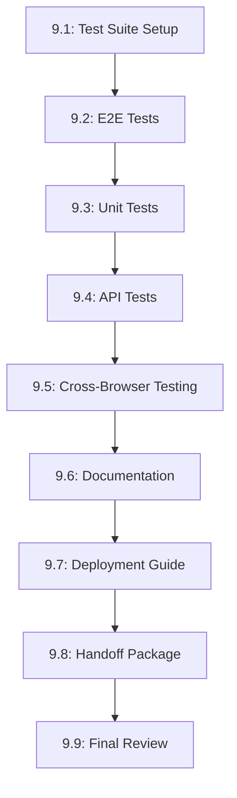

# Tasks --- M9: Final QA & Handoff

## Overview

This milestone covers final QA testing, documentation, and handoff preparation for the portfolio.

## Task Dependency Graph

## Tasks

### Phase 1: Testing

#### Task 9.1: Test Suite Setup

- **Status**: TODO
- **Estimate**: 25 minutes
- **Dependencies**: []
- **Type**: Setup
- **Description**: Set up testing infrastructure
- **Steps**:
  1. Install testing framework
  2. Configure test runner
  3. Set up test directories
  4. Create test utilities
  5. Document testing approach

#### Task 9.2: E2E Tests

- **Status**: TODO
- **Estimate**: 45 minutes
- **Dependencies**: [9.1]
- **Type**: Testing
- **Description**: Create end-to-end tests
- **Steps**:
  1. Test home page load
  2. Test navigation between sections
  3. Test chatbot integration
  4. Test contact form submission
  5. Test responsive layouts

#### Task 9.3: Unit Tests

- **Status**: TODO
- **Estimate**: 40 minutes
- **Dependencies**: [9.1]
- **Type**: Testing
- **Description**: Create unit tests for components
- **Steps**:
  1. Test row components
  2. Test card components
  3. Test navigation logic
  4. Test form validation
  5. Achieve > 80% coverage

#### Task 9.4: API Tests

- **Status**: TODO
- **Estimate**: 30 minutes
- **Dependencies**: [9.1]
- **Type**: Testing
- **Description**: Test API endpoints
- **Steps**:
  1. Test chat API endpoint
  2. Test ingestion API endpoint
  3. Test status API endpoint
  4. Test error handling
  5. Test response formats

### Phase 2: Testing & Documentation

#### Task 9.5: Cross-Browser Testing

- **Status**: TODO
- **Estimate**: 35 minutes
- **Dependencies**: [9.2]
- **Type**: Testing
- **Description**: Test in all supported browsers
- **Steps**:
  1. Test in Chrome latest
  2. Test in Firefox latest
  3. Test in Safari latest
  4. Test in Edge latest
  5. Document browser-specific issues

#### Task 9.6: Documentation

- **Status**: TODO
- **Estimate**: 40 minutes
- **Dependencies**: [9.1]
- **Type**: Setup
- **Description**: Create comprehensive documentation
- **Steps**:
  1. Update README.md
  2. Document component API
  3. Document content structure
  4. Add developer setup guide
  5. Link documentation in project

#### Task 9.7: Deployment Guide

- **Status**: TODO
- **Estimate**: 30 minutes
- **Dependencies**: [9.6]
- **Type**: Setup
- **Description**: Create deployment guide
- **Steps**:
  1. Document deployment process
  2. List environment variables
  3. Add troubleshooting tips
  4. Document rollback procedure
  5. Include deployment checklist

#### Task 9.8: Handoff Package

- **Status**: TODO
- **Estimate**: 35 minutes
- **Dependencies**: [9.7]
- **Type**: Setup
- **Description**: Create handoff package
- **Steps**:
  1. Compile project summary
  2. Create content guide
  3. Write user manual
  4. Document support info
  5. Package everything

#### Task 9.9: Final Review

- **Status**: TODO
- **Estimate**: 30 minutes
- **Dependencies**: [9.5, 9.6, 9.8]
- **Type**: Testing
- **Description**: Final project review
- **Steps**:
  1. Review all requirements
  2. Verify all tests pass
  3. Check documentation
  4. Performance audit
  5. Security review

## Summary

| Category | Count | Estimate |
|----------|-------|----------|
| Setup | 4 | 130 minutes |
| Testing | 5 | 185 minutes |
| **Total** | **9** | **315 minutes** |

## Acceptance Criteria

1. All E2E tests pass
2. Test coverage > 80%
3. Cross-browser testing complete
4. Documentation up to date
5. Handoff package delivered

## References

- [M9 Requirements](./requirements.md)
- [M8 Security](../M8-Security/)